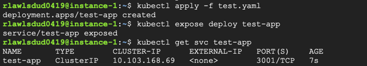
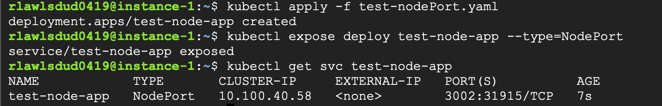
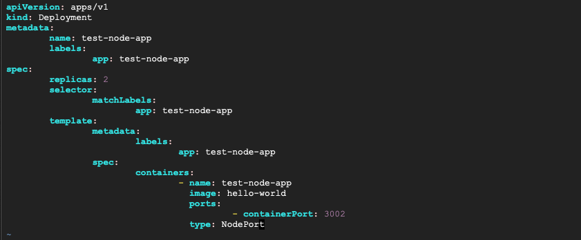
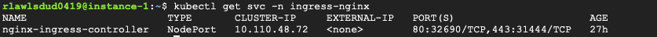
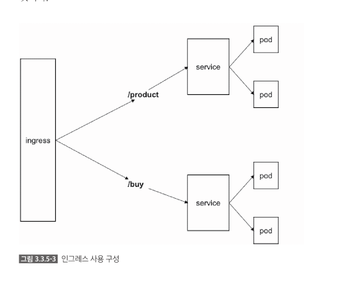
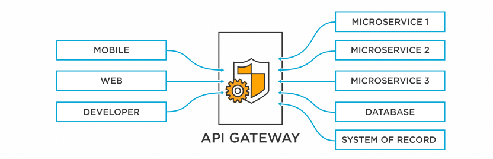
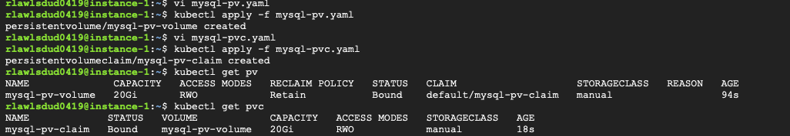
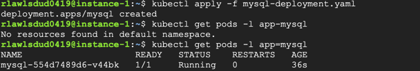
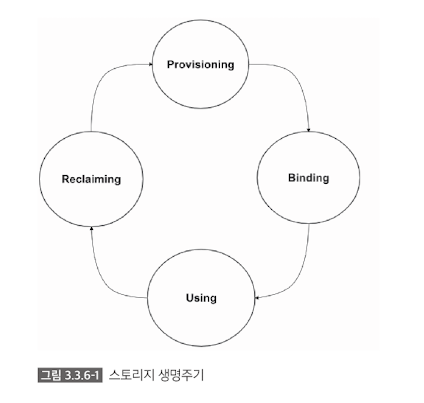
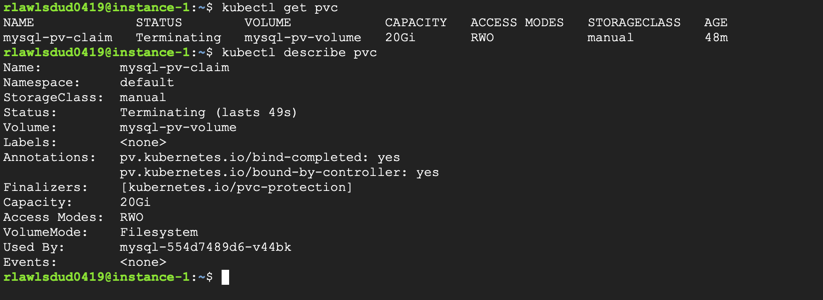

## 3.3.4 서비스(Service)  

- 쿠버네티스에서의 서비스는 파드에 접근할 수 있도록 정책을 정의하는 것입니다.  
- 파드끼리 통신할 수 있도록 엔드포인트를 만들어 주고, 파드가 외부에 노출될 수 있도록 합니다.     


### 옵션 
서비스에 사용하는 많은 옵션과 다른 패턴들이 있지만, 주요 옵션 4가지에 대해 설명합니다.  
아래 네가지 옵션은 서비스가 파드를 노출해줄 수 있는 방식을 설명한 것입니다.       

1. ClusterIp
  - 서비스가 클러스터-내부IP에 노출되도록 합니다. 
  - 클러스터 내에서만 서비스에 도달할 수 있습니다. 
  - serviceTypes의 기본값입니다. 

2. NodePort  
  - 고정포트(NodePort)로 각 노드의 IP에 서비스가 노출되도록 합니다. 
  - NodePort 서비스가 라우팅되는 ClusterIP 서비스가 자동으로 생성됩니다. 
  - <NodeIP>:<NodePort> 로 요청하여 클러스터 외부에서 NodePort 서비스에 접속할 수 있습니다.

3. LoadBalancer  
  - 클라우드 공급자의 로드밸런서를 사용하여 서비스가 외부에 노출되도록 합니다. 
  - 외부 로드 밸런서가 라우팅되는 NodePort와 ClusterIP 서비스가 자동으로 생성됩니다. 

4. ExternalName
  - 값과 함께 CNAME 레코드를 리턴하여, 서비스를 externalName 필드의 콘텐츠(foo.bar.example.com 등)에 매핑합니다.
이때 어떤 종류의 프록시도 설정되어 있지 않습니다.


### ClusterIP 

```
$ kubectl apply -f nodejs.yaml 
deployment.apps/nodejs-app created 

$ kubectl expose deploy nodejs-app
service/nodejs-app exposed 
```


- 앞장에서 생성한 nodejs-app 디플로이먼트를 사용하여 서비스를 생성하는 명령어 입니다.
- 명령문에 아무런 옵션을 지정하지 않으면 ClusterIP(클러스터 내부 IP에 노출하는 것) 옵션이 자동으로 부여됩니다.

  


### NodePort


- 외부에 노출하기 위해서는 NodePort 옵션을 사용합니다. 
- type=NodePort 옵션의 사용유무에 따라 외부에 노출되는 포트가 부여되는지가 결정됩니다. 
- 여기서는 외부에서 31915 포트를 사용하여 해당 파드와 통신할 수 있습니다. 






---

## 3.3.5 인그레스(Ingress) 
- 인그레스는 클러스터 외부에서 클러스터 내부 서비스로 접속하도록 해줍니다.     
- 구성요소에는 인그레스 리소스, 인그레스 컨트롤러가 있습니다.  
- 단일 파드를 노출하는 것은 `kubectl expose` 명령어를 사용하여 노출하는 것과 효과는 비슷하지만, 그 이외의 복잡한 상황에서는
인그레스가 더 많은 기능을 제공합니다. 

```
// nginx용 ingress-nginx 
$ kubectl apply -f https://raw.githubusercontent.com/kubernetes/ingress-nginx/nginx-0.29.0/deploy/static/mandatory.yaml

$ kubectl expose deploy nginx-ingress-controller --type=NodePort -n ingress-nginx 
service/nginx-ingress-controller exposed
```

  

외부에 열려있는 포트를 사용하여 브라우저에서 접속하면 404 에러가 표시됩니다. 


   
(이거 저는 그냥 연결실패가 뜨네용..... 되시는 분 있다면 알려주셔요ㅎㅎㅎㅎ)

404 에러가 발생한다면, 인그레스 설치에 성공한 것입니다!!  
에러의 원인은 인그레스가 설치는 되었지만, 실제로 서비스를 실행한 파드에 연결을 시키지 않았기 때문인데요. 
연결을 어떻게 시키는지 지금부터 살펴보겠습니다.  

```
$ kubectl run test-node-app --image hello-world --port=3002 
$ kubectl get pod
$ kubectl expose pod nodejs-app 
``` 

지금까지의 실습은 `서비스 생성 -> 파드 생성 -> 설치된 nginx를 외부에 노출` 하는 과정이었지만,    
이번에는 인그레스를 사용하여 외부에 노출하는 방법을 설명합니다.   

```yaml
apiVersion: extensions/v1beta1
kind: Ingress
metadata: 
  name: nodejs-ingress
  annotations:
    nginx.ingress.kubernetes.io/rewrite-target: / 
spec: 
  rules: 
    - host: foo.bar.com
      http:
        paths:
          - path: /nodejs
            backend:
              serviceName: nodejs-app
              servicePort: 3000
```


```yaml
$ kubectl apply -f nodejs-ingress
$ kubectl get ingress
```

foo.bar.com 도메인을 사용하는 nodejs-ingress 가 생성됩니다.  


foo.bar.com 도메인으로 접속해야 하므로 hosts 파일에 해당 도메인을 추가시킵니다. 
```yaml
$ sudo vi /etc/hosts

// 아래 내용 추가 
// 127.0.0.1      foo.bar.com 
```




- 위의 그림과 같이, 인그레스를 사용하면 서비스별로 외부에 노출하기 위해 포트가 달라지면서 엔드포인트가 달라졌던 부분을,  
인그레스에서 설정한 호스트와 서브 URL 을 사용하여 간단하게 정리할 수 있습니다. 
- 위 그림은 마이크로서비스 아키텍처를 사용한 운영 서비스의 API 게이트웨이와 같은 기능을 제공합니다.  
그래서 다른 API 게이트웨이를 사용하기 쉽지 않을 때는 k8s에서 제공하는 인그레스로 간단하게 API 게이트웨이 같은 기능을 사용할 수 있습니다. 

> API Gateway?   
> 실제 백엔드 서비스 또는 데이터와 접속하고 API 호출에 대한 정책, 인증 및 일반 액세스 제어를 적용하여 중요한 데이터를 보호하는 트래픽 관리자입니다.  
>  요청을 적절한 서비스로 라우팅하고 요청자에게 응답을 다시 보내는 기능을 담당합니다.   
> PI 게이트웨이는 클라이언트의 모든 API 호출을 가져와 요청 라우팅, 구성 및 프로토콜 변환을 사용하여 올바른 마이크로서비스로 라우팅합니다.


  


## 3.3.6 스토리지(Storage)

- 컨테이너의 가장 큰 장점은 가볍다는 것입니다. 따라서 장애가 발생해도 금방 다시 생성할 수 있습니다.
- 컨테이너를 가볍게 하기 위해서는 상태가 없는 부분만 컨테이너화 해야 합니다. (ex. 실행환경O, 데이터X) 
- 만일 데이터 파일까지 컨테이너에 포함된다면 컨테이너의 용량은 계속 늘어날 것이며, 시스템 운영상 이슈가 발생할 수 있ㅅ브니다. 
- 쿠버네티스는 볼륨 추상화 기능을 제공합니다. 
  - pod 내의 컨테이너끼리 파일을 공유해야 할 때 유용하게 사용할 수 있습니다.

### 볼륨을 사용하는 방식
리눅스의 경우 볼륨을 지정하고 마운트만 하면 되지만, 쿠버네티스에서는 pv, pvc가 존재하며 사용법이 난해할 수 있습니다.   

1. PV
  - PersistentVolume
  - 볼륨 리소스 그 자체 
  - 파드의 생명주기와는 별도로 PV를 지정하고 사용 가능 
2. PVC
  - PersistentVolumeClaim
  - 사용자가 볼륨에 요청하는 방식을 정의한 것 
  - pvc로 인해 파드와 pv의 의존성 줄이기 가능 

### pv 생성 
```yaml
// mysql-pv.yaml

apiVersion: v1
kind: PersistentVolume
metadata:
        name: mysql-pv-volume
        labels:
                type: local
spec:
        storageClassName: manual
        capacity:
                storage: 20Gi
        accessModes:
                - ReadWriteOnce
        hostPath:
                path: "/mnt/data"
```

### pvc 생성 

파드가 PV에게 요청하는 것을 정의한 PVC를 생성합니다.   

```yaml
// mysql-pvc.yaml

apiVersion: v1
kind: PersistentVolumeClaim
metadata:
        name: mysql-pv-claim
spec:
        storageClassName: manual
        accessModes:
                - ReadWriteOnce
        resources:
                requests:
                        storage: 20Gi
```



```yaml
// pv, pvc가 잘 생성되었는지 확인
// status가 Bound 상태로 성공적으로 생성됨 (pending=생성실패)  
$ kubectl get pv
$ kubectl get pvc 
```

```yaml
apiVersion: apps/v1 
kind: Deployment
metadata:
  name: mysql
spec:
  selector:
    matchLabels:
      app: mysql
  strategy:
    type: Recreate
  template:
    metadata:
      labels:
        app: mysql
    spec:
      containers:
      - image: mysql:5.6
        name: mysql
        env:
        - name: MYSQL_ROOT_PASSWORD
          value: password
        ports:
        - containerPort: 3306
          name: mysql
        volumeMounts:
        - name: mysql-persistent-storage
          mountPath: /var/lib/mysql
      volumes:
      - name: mysql-persistent-storage
        persistentVolumeClaim:
          claimName: mysql-pv-claim
```



```yaml
// 정상 작동 확인   
$ kubectl run -it --rm --image=mysql:5.6 --restart=Never mysql-client -- mysql -h mysql -ppassword
// mysql deployment 삭제 
$ kubectl delete -f mysql-deployment.yaml  
```

- 디플로이먼트, 파드를 삭제해도 PV, PVC는 남아있습니다. 
- PV, PVC 는 파드와 별개로 생성했기 때문에 전혀 의존성이 없습니다. 
- 따라서 파드를 다시 생성하더라도 기존의 데이터는 그대로 남아있습니다. 


### 생명주기 

  

1. 프로비저닝 
  - 퍼시스턴트 볼륨(PV)을 생성하는 단계. 
  - static, dynamic 두가지 방법이 있음. 
    - static : 프로비저닝할 때 미리 PV을 만들어 놓고 PVC를 통해 사용하는 파드에 연결하는 것    
    - dynamic : PVC를 통해 사용하려고 할 때 권한이나 용량을 정해서 유동적으로 사용할 수 있도록 하는 방법  
2. 바인딩
  - 프로비저닝을 통해 생성된 PV를 PVC에 바인딩하는 단계
3. 사용중 
  - PVC가 파드에 설정되어 PV가 실직적으로 사용되는 단계
  - 파드가 사용하고 있는 PVC는 임의로 삭제할 수 없음

`$ kubectl delete pvc mysql-pv-claim` 으로 pvc를 삭제하고 pvc의 상태를 확인합니다.  
완전히 삭제되지 않고 pvc-protection 정책이 적용된 것을 볼 수 있습니다.  
mysql pod로 접속해서 확인해보면 이전의 데이터들이 그대로 남아있는 것을 볼 수 있습니다. 

  


4. 리클레이밍 
  - PVC가 삭제된 후 PV가 초기화되는 과정입니다. 
  - 초기화 옵션으로는 retain, delete, recycle이 있습니다.
  - persistentVolumeReclaimPolicy 옵션을 추가하면 됩니다. 


## 3.3.7 노드 
- 노드는 파드를 실행할 수 있는 물리적인 공간입니다.
- 대부분 하나의 VM으로 구성되어 있습니다. 
- 쿠버네티스의 스케줄러에 의해 파드가 할당됩니다.


### 노드의 상태 
1. Ready 
  - 노드의 상태가 양호하며 파드를 수용할 준비가 되어 있는 경우 True
  - 노드의 상태가 불량하여 파드를 수용하지 못할 경우 False
  - 노드 컨트롤러가 마지막 node-monitor-grace-period(기본값 40 기간동안 노드로부터 응답을 받지 못한 경우) Unknown
2. NotReady 
  - 노드의 상태가 완전치 않은 상태 
3. MemoryPressure
  - 노드 메모리 상에 압박이 있는 경우
  - 노드 메모리가 넉넉치 않은 경우 True 
4. PIDPressure
  - 프로세스 상에 압박이 있는 경우 
  - 노드 상에 많은 프로세스가 존재하는 경우 True
5. DiskPressure
  - 디스크 사이즈 상에 압박이 있는 경우
  - 디스크 용량이 넉넉치 않은 경우 True
6. NetworkUnavailable
  - 노드에 대해 네트워크가 올바르게 구성되지 않은 경우 True 
